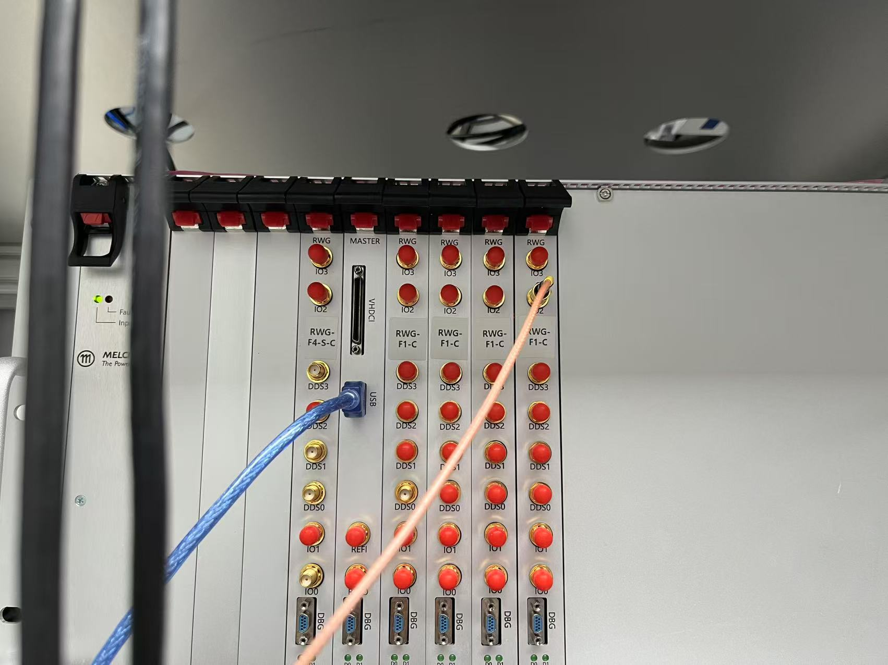

# RTMQ 使用文档

## 1.开机准备

1. 检查功放电源是否开启，负载是否正确连接。时序系统开机，检查USB线是否正确连接，如果打开软件后显示序列号不对，可以检查硬件线缆连接。
2. 运行emqx：打开RTMQ文件夹，执行emqx.cmd（如果有，没有可以找sjp编写）
3. 在终端内运行jupyter_server.cmd 
!!! note
    等待浏览器打开jupyter lab界面。如果终端有输出"Exp.ipynb - idle"即为开启成功。最小化终端弹窗和浏览器弹窗，不要关闭。

4. 在VScode中打开实验jupyter文件（Exp.ipynb） 
!!!内核选择
    选择其他内核-现有jupyter服务器-localhost-Python 3 (ipykernel)(py/Exp.ipynb) 

5. 运行`py/Exp.ipynb`中的代码，开始进行实验
!!! quote ""
    406 xyz学姐的台子是在'Main/XYZ.ipynb'中的，不是在Exp.ipynb中的，内核选择也是Main/XYZ.ipynb的内核。

## 2.代码逻辑介绍
!!! quote ""
    如无特别注释，默认当前文件夹为`RTMQ`文件夹下的`py`文件夹，如无特殊需要请勿改动。

### 2.1 Exp.**py**
`Exp.py`（注意不是`Exp.ipynb`） 是时序的代码编译器，将时序代码翻译为机器能够识别的指令集。
其中可能需要改动的地方为第13行的rwg_slots和第15行的gpio_dir。

!!! warning
    每次改动需要重启内核，重新运行Exp.ipynb

- rwg_slot: 使用的板卡编号。板卡编号与板卡在机箱中的位置一致，从左至右依次为[1，2，3，4，0，5，6，7]。
- ctr_slot: 用于计数的板卡编号。计数板卡属于rwg_slot的一种，但是在计数时需要单独指定。

{: loading=lazy }

- Master板卡，即机箱主控板不计入编号。空置的板卡位也有编号，对应安装时的0号板卡。

- gpio_dir: 板卡的IO声明。 每张板卡都有4个TTL输入/输出口（IO 0~3）。Master板卡连接了TTL转接盒(高密度接插件，现在实验室基本都没有用到)，有32个IO通道。

- gpio_dir第一行的部分长度必须与rwg_slot的长度一致，对应RWG板卡的IO。0b0000中的后四位数字表示4个IO通道的输入/输出特性，0表示输出，1表示输入。gpio_dir第二行表示Master板卡连接的TTL转接盒的32通道输入/输出特性。遵循二进制写法（示例：rwg_slot=[2,3,6,7],gpio_dir=[0b0000,0b0000,0b0000,0b1000,0b00000000_00000000_00000000_00000000]，表示只有板卡7对应的最高位通道（即通道15）为输入）

### 2.2 config.ipynb
config文件存在`config.ipynb`。 config文件中储存了每个通道状态的预设情况。
<!-- config.ipynb运行后将会在本文件夹中生成并写入数据库config.db。 -->
!!! warning
    config.ipynb的运行内核不可以与Exp.ipynb一样。建议内核：Python 3.11.2 （d:\Tools\Python\python.exe）
    如果想要在现有数据库中增加或更改一些东西，可以直接运行config.ipynb。每次改动也需要重启内核，重新运行Exp.ipynb
如何编辑config请见config.ipynb的注释并结合序列定义的文件。

### 2.3 日常运行的文件
!!! quote ""
    日常运行的文件，即ipynb文件，储存在`2024`中， 以日期命名。本文件将进行时序的最终编辑和运行。
    请在了解了config.ipynb的编辑逻辑后再尝试在此独立编辑时序。

!!! Intro 
    本文件中使用的Seq类型与config中的DDS,Wave类型的区别：

    - DDS类型写入的是单个通道在某个时刻的状态。TTL类型同理，不过TTL只有0，1两种状态。
    - Wave类型写入的是某个时刻所有开启的通道的状态。没有写入的DDS通道默认为off,TTL默认为0。
    - Seq类型写入的是由Wave组成的所有通道的时序。将Wave依次组合起来，并给出每段Wave的运行时间，按顺序播放。
    本质上，Seq是由Wave组成的list，直接写为list也可以运行。

如何编写Seq类型：

1. 生成空的时序seq = Seq(Wave)
   
2. 添加时序 seq.MOT(time_of_mot), 如果添加的Wave是多段的，则需要输入多个时间。seq.Probe(t0,t1,t2,t3)

如何运行Seq:

1. Exp.Run({2:seq},1)： 2表示Master板卡的位置len(rwg_slot) + 1， seq为要执行的时序， 1表示重复一次（默认值是100）。为了解决分段过多的问题，不同的板卡可以执行不同的时序。
2. 在执行的时候，与rwg_slot不同，RWG板卡的编号从0开始，此处为0，1。Master板卡默认为最后一个，此处为2。
3. 多端时序： 例如Exp.Run({0：seq0,2:seq},1)，没有注明的板卡将运行和Master相同的时序。

